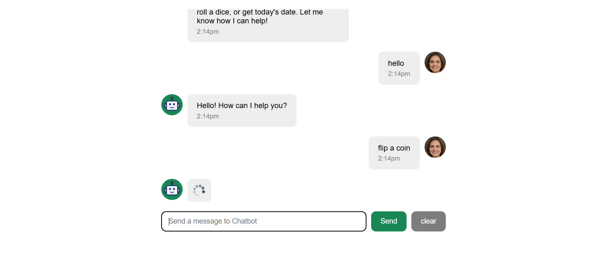

# React Chatbot Project


A conversational chatbot web application built with React as a first major React project. The app simulates a real chat interface where users can send messages, receive async bot responses, and have their conversation history persisted across browser sessions.

---

## Project Description

This project is a fully interactive chatbot UI built from scratch using React 19 and Vite. The user types a message into an input field, sends it, and receives a response from a chatbot powered by the `supersimpledev` library. While the bot is processing a reply, a loading spinner is shown in place of the response to simulate real async behavior. All messages are saved to `localStorage`, so conversations persist even after the browser is closed or refreshed. The app also includes extended bot commands (such as generating unique IDs and saying goodbye), keyboard shortcuts, and a clear chat button to reset the conversation.

---

## Features

- **Two-way chat messaging** — Users can send messages and receive bot responses in a clean, styled chat interface
- **Async bot responses** — Bot replies are fetched asynchronously using `async/await`, accurately simulating real-world API behavior
- **Loading spinner** — A spinner GIF is displayed as a temporary message bubble while the bot is processing a reply
- **Message timestamps** — Every message (user and bot) displays a formatted timestamp using Day.js (e.g., `2:14pm`), shown only after the response is received (not on the spinner)
- **Auto-scroll** — The chat window automatically scrolls to the latest message after each new message is added
- **localStorage persistence** — Chat history is saved to `localStorage` and reloaded on page refresh, so conversations are not lost
- **Clear chat functionality** — A "clear" button resets the entire chat history both in state and in `localStorage`
- **Controlled input field** — The text input is a fully controlled React component, cleared automatically after each message send
- **Keyboard shortcuts** — Pressing `Enter` sends the message; pressing `Escape` clears the input field
- **Loading state guard** — Sending is blocked while the bot is still responding, preventing duplicate or overlapping messages
- **Extended bot commands** — Custom responses added for `"goodbye"` and `"give me a unique id"` (which returns a `crypto.randomUUID()` result)
- **Welcome message** — A greeting is shown when the chat history is empty, and disappears once the first message is sent
- **Avatar images** — Distinct profile images are shown for both the user and the robot, aligned to their respective sides of the chat

---

## Live Behavior — Step by Step

1. **Page loads** — The app reads `localStorage` for any saved messages. If messages exist, they are rendered immediately. If not, a welcome message is displayed.
2. **User types a message** — The input field is a controlled component; every keystroke updates the `inputText` state.
3. **User sends a message** — Either by clicking the "Send" button or pressing `Enter`. If the input is empty or a response is still loading, the action is ignored.
4. **User message appears** — The message is added to `chatMessages` state with a unique ID, sender label, and timestamp. The input field is cleared.
5. **Spinner appears** — Before the async call resolves, a spinner GIF is injected as a temporary bot message bubble in the chat list.
6. **Bot response is fetched** — `Chatbot.getResponseAsync()` is called with the user's message. The app awaits the result.
7. **Spinner is replaced** — Once the response arrives, the spinner message is replaced by the actual bot reply (with its own timestamp).
8. **Auto-scroll triggers** — The custom `useAutoScroll` hook detects the state change and scrolls the message container to the bottom.
9. **State is persisted** — A `useEffect` watching `chatMessages` writes the updated array to `localStorage` after every change.
10. **Clear button** — Clicking "clear" sets `chatMessages` to an empty array, which triggers the `useEffect` to wipe `localStorage` and shows the welcome message again.

---

## Technologies Used

| Technology            | Purpose                                                                             |
| --------------------- | ----------------------------------------------------------------------------------- |
| **React 19**          | UI rendering, component architecture, and state management                          |
| **Vite**              | Fast development server and build tool                                              |
| **JavaScript (ES6+)** | Core application logic, async/await, destructuring, spread operators                |
| **Day.js**            | Lightweight date/time formatting for message timestamps                             |
| **supersimpledev**    | Chatbot library providing `chatbot.addResponses()` and `Chatbot.getResponseAsync()` |
| **Web Crypto API**    | `crypto.randomUUID()` used for unique message IDs and bot command output            |
| **localStorage API**  | Browser storage for persisting chat history across sessions                         |
| **CSS (plain)**       | Component-scoped stylesheets for layout, flexbox, and visual design                 |

---

## React Concepts Covered

This project demonstrates a wide range of core React concepts, making it a strong portfolio piece for a React learner.

### `useState`

Used in both `App.jsx` and `ChatInput.jsx`. `chatMessages` tracks the full list of chat objects. `inputText` tracks the controlled input value. `isLoading` tracks whether the bot is currently processing a reply.

### `useEffect`

Used twice in `App.jsx`. One effect persists `chatMessages` to `localStorage` whenever the messages array changes. A second runs once on mount (`[]` dependency) to register custom bot responses via `chatbot.addResponses()`.

### `useRef`

Used inside the custom `useAutoScroll` hook to hold a direct reference to the chat messages container DOM element, allowing programmatic scrolling without triggering re-renders.

### Custom Hooks

`useAutoScroll` is a custom hook defined in `hooks/useAutoScroll.jsx`. It abstracts the scroll logic (creating a ref and a `useEffect`) and returns the ref to be attached to any container. This demonstrates understanding of hook encapsulation and reusability.

### Props

All components receive data and callbacks via props. For example, `ChatMessages` and `ChatInput` both receive `chatMessages` and `setChatMessages` as props from `App`. `ChatMessage` receives `message`, `sender`, `time`, and `key` from `ChatMessages`.

### Component Structure

The app is split into clearly separated components: `App` (root), `ChatMessages` (message list), `ChatMessage` (individual message bubble), and `ChatInput` (input bar). Each component has a single, well-defined responsibility.

### Conditional Rendering

The welcome message only renders when `chatMessages.length === 0`. The robot avatar only renders when `sender === "robot"`, and the user avatar only when `sender === "user"`. Timestamps only render when a `time` prop is present (not on the spinner message).

### List Rendering

`ChatMessages` maps over the `chatMessages` array to render a `ChatMessage` for each entry. Each item uses `chat.id` (a UUID) as the `key` prop, satisfying React's list reconciliation requirement.

### Controlled Inputs

The `<input>` in `ChatInput` has its `value` bound to `inputText` state and its `onChange` bound to `saveInputText`. This makes it a fully controlled component where React owns the input's value at all times.

### Event Handling

- `onChange` on the input field to track typing
- `onClick` on the Send and Clear buttons
- `onKeyDown` on the input to handle `Enter` (send) and `Escape` (clear input)

### Async / Await

`sendMessage` is an `async` function. It awaits `Chatbot.getResponseAsync()`, and manages intermediate state (spinner insertion, loading flag) correctly around the await boundary.

### State Updates Based on Previous State

When constructing `newChatMessages`, the spread operator (`...chatMessages`) is used to build a new array immutably before calling `setChatMessages`, following React best practices for not mutating state directly.

### Side Effects

`useEffect` is used to synchronize React state to an external system (`localStorage`) — a textbook use of effects for side effects beyond rendering.

### `crypto.randomUUID()`

Used to generate unique `id` values for every message object, ensuring stable and unique `key` props in the list and preventing React reconciliation issues.

---

## Project Structure

```
chatbot-project/
├── public/
├── src/
│   ├── assets/
│   │   ├── loading-spinner.gif   # Spinner shown during bot response
│   │   ├── profile-1.jpg         # User avatar image
│   │   ├── robot.png             # Robot/bot avatar image
│   │   └── react.svg
│   ├── components/
│   │   ├── ChatInput.jsx         # Controlled input bar with Send and Clear buttons
│   │   ├── ChatInput.css
│   │   ├── ChatMessage.jsx       # Single message bubble (user or robot)
│   │   ├── ChatMessage.css
│   │   ├── ChatMessages.jsx      # Scrollable message list container
│   │   └── ChatMessages.css
│   ├── hooks/
│   │   └── useAutoScroll.jsx     # Custom hook: ref + effect for auto-scrolling
│   ├── App.jsx                   # Root component: state, effects, layout
│   ├── App.css
│   ├── index.css
│   └── main.jsx                  # React DOM entry point (StrictMode)
├── package.json
└── vite.config.js
```

**Key file roles:**

- **`App.jsx`** — Owns the top-level `chatMessages` state and `localStorage` sync. Composes the full layout.
- **`ChatInput.jsx`** — Manages `inputText` and `isLoading` state locally. Handles all user interaction for sending messages.
- **`ChatMessage.jsx`** — Pure presentational component. Renders a single message bubble with the correct layout, avatar, and timestamp depending on `sender`.
- **`ChatMessages.jsx`** — Renders the list of messages and applies the auto-scroll ref.
- **`useAutoScroll.jsx`** — Reusable custom hook that encapsulates the scroll-to-bottom logic using `useRef` and `useEffect`.

---

## How to Run the Project

**Prerequisites:** Node.js (v18 or higher) and npm installed.

```bash
# 1. Clone or download the project
git clone https://github.com/manas-mondal/chatbot-project.git
cd chatbot-project

# 2. Install dependencies
npm install

# 3. Start the development server
npm run dev

# 4. Open in browser
# Vite will display a local URL, typically: http://localhost:5173
```

To create a production build:

```bash
npm run build
npm run preview
```

---

## Screenshots

| Chat Interface                                    |
| ------------------------------------------------- |
|  |

---

## Learning Outcomes

This project demonstrates practical, hands-on understanding of the following skills:

- **State management** — Managing multiple pieces of state across components, including shared state lifted to a parent component
- **Component design** — Breaking a UI into focused, reusable components with clear props contracts
- **Async operations** — Correctly handling async bot responses, loading states, and state transitions around `await`
- **Data persistence** — Syncing React state to `localStorage` using `useEffect` for cross-session data storage
- **Custom hooks** — Extracting reusable stateful logic (`useAutoScroll`) into a dedicated hook
- **UI interaction logic** — Handling user input through controlled components, keyboard events, and button clicks
- **Conditional and list rendering** — Dynamically rendering UI based on state values and mapping data arrays to components
- **Immutable state updates** — Using spread operators to create new arrays rather than mutating state directly
- **Project structure** — Organizing a React project into `components/`, `hooks/`, and `assets/` folders following common conventions

---

## Future Improvements

The following features could be added to extend this project further:

- **Dark mode** — Add a theme toggle using a CSS class on the root element, stored in `localStorage`
- **Real AI API integration** — Replace `supersimpledev` with calls to a real LLM API (e.g., OpenAI or Anthropic) for intelligent responses
- **Multiple chat sessions** — Allow users to create, name, switch between, and delete separate conversations
- **Message search** — Add a search bar to filter and highlight messages containing a keyword
- **Typing indicator animation** — Replace the static spinner GIF with a CSS-animated three-dot typing indicator
- **Message reactions** — Let users "like" or react to individual bot messages
- **Error handling** — Display a friendly error message if the bot API call fails
- **Responsive / mobile design** — Improve the layout for smaller screen sizes
- **Export chat** — Allow users to download their chat history as a `.txt` or `.json` file
- **Sound notifications** — Play a subtle sound when a new bot message arrives

---

## Author

**Author:** Manas Mondal  
**Role:** Full Stack Developer (React Learner)  
**Project type:** Personal learning project — first major React application
